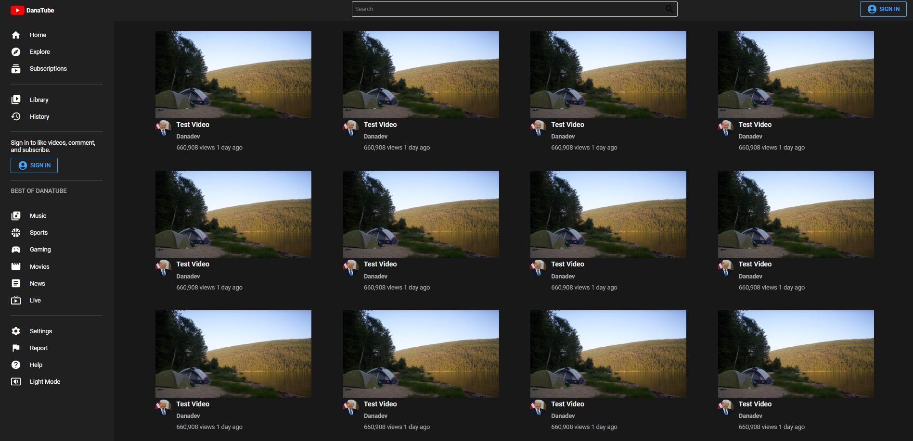
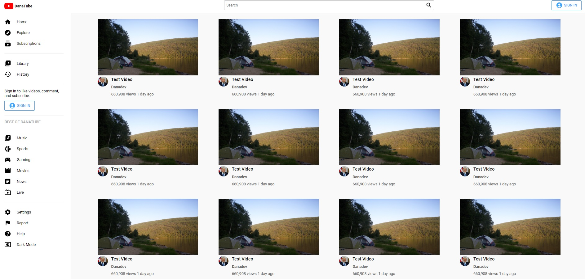
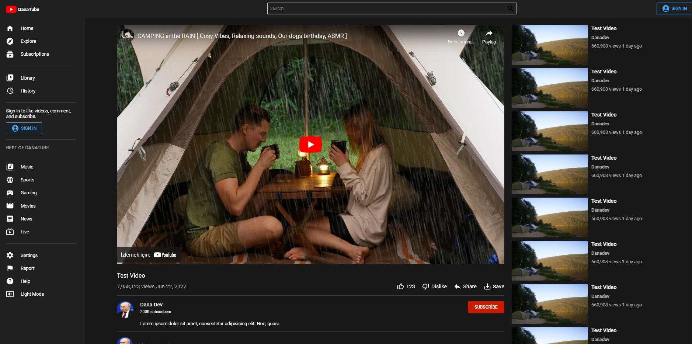
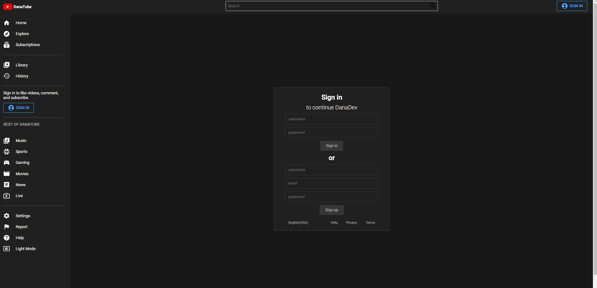

<!-- PROJECT LOGO -->
 

  

<h3 align="center">
youtube-clone-app
</h3>

 

<!-- ABOUT THE PROJECT -->
## About The Project
<h4><strong>Client Page</strong></h4>

(<a href="#readme-top">back to top</a>)

### Built With

* [![React][React.js]][React-url]
* ![HTML5][HTML5]
* [![MUI][MUI]][MUI-url]

(<a href="#readme-top">back to top</a>)

<!-- ROADMAP -->
## Roadmap

- [x] Material UI
    - [x] Material UI (MUI) sx prop
    - [x] MUI Components
    - [x] MUI Themes
    - [x] Mui Layouts (Box, Container, Grid, Stack)
    - [x] Mui Responsive Design
    - [x] Mui App Bar (Navbar)
    - [x] Mui Menu
    - [x] Mui Sidebar
    - [x] Mui Cards (Social Media Card Example)
    - [x] Mui Right Menu
    - [x] Mui Tooltip, Fab, Icons
    - [x] Mui Modal 
    - [x] Mui Dark Mode
- [x] Fixing Bugs

(<a href="#readme-top">back to top</a>)

<!-- CONTACT -->
## Contact

Utku Coşkun -  - utkucoskun1@gmail.com

(<a href="#readme-top">back to top</a>)

<!-- MARKDOWN LINKS & IMAGES -->
<!-- https://www.markdownguide.org/basic-syntax/#reference-style-links -->

[React.js]: https://img.shields.io/badge/React-20232A?style=for-the-badge&logo=react&logoColor=61DAFB&style=plastic&Width=30
[React-url]: https://reactjs.org/
[MUI]: https://img.shields.io/badge/MUI-%230081CB.svg?style=for-the-badge&logo=mui&logoColor=white&style=plastic&Width=30
[MUI-url]: https://mui.com/
[HTML5]:https://img.shields.io/badge/html5-%23E34F26.svg?style=for-the-badge&logo=html5&logoColor=white&style=plastic&Width=30
